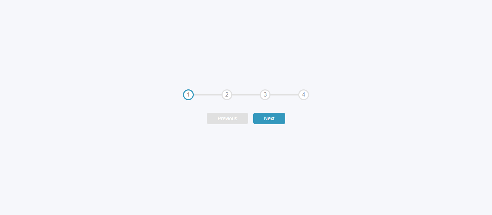

# progress-steps

A simple, lightweight HTML & CSS prototype for a horizontal multi-step progress indicator.  
This project shows how to build a series of steps (e.g., step 1 → step 2 → … → step N) with styling for current, completed, and upcoming steps.

---

## 📸 Preview

---

## 🧱 Features

- Pure HTML + CSS (no JavaScript)
- Clean, responsive horizontal step design
- Highlights completed, current, and upcoming steps
- Example included (`index.html`)

## 📁 Project Structure

